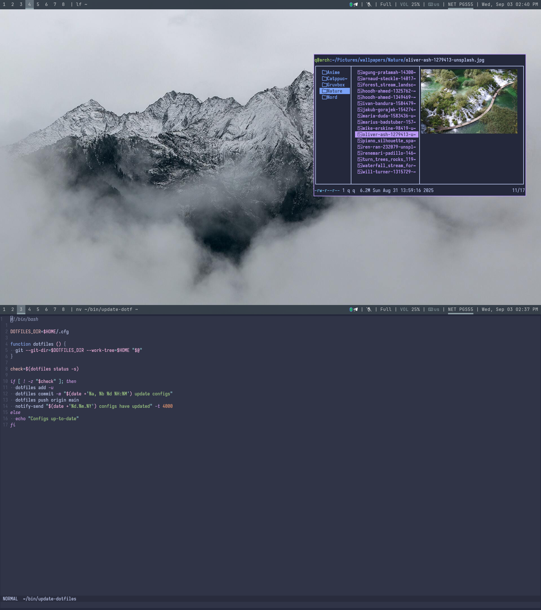

### Current rice

# Setup
- **wm** [**`bspwm`**](https://github.com/fakeowl1/dotfiles/tree/main/.config/bspwm)
- **terminal** [**`kitty`**](https://github.com/fakeowl1/dotfiles/tree/main/.config/kitty)
- **editor** [**`neovim`**](https://github.com/fakeowl1/dotfiles/tree/main/.config/nvim)
- **status bar** [**`polybar`**](https://github.com/fakeowl1/dotfiles/tree/main/.config/polybar)
- **launcher** [**`rofi`**](https://github.com/fakeowl1/dotfiles/tree/main/.config/rofi)
- **shell** [**`fish`**](https://github.com/fakeowl1/dotfiles/tree/main/.config/fish)
- **notifications** [**`dunst`**](https://github.com/fakeowl1/dotfiles/tree/main/.config/dunst)
- [**`shell scripts`**](https://github.com/fakeowl1/dotfiles/tree/main/bin)
- [**`user systemd units`**](https://github.com/fakeowl1/dotfiles/tree/main/.config/systemd/user)

# TODO
