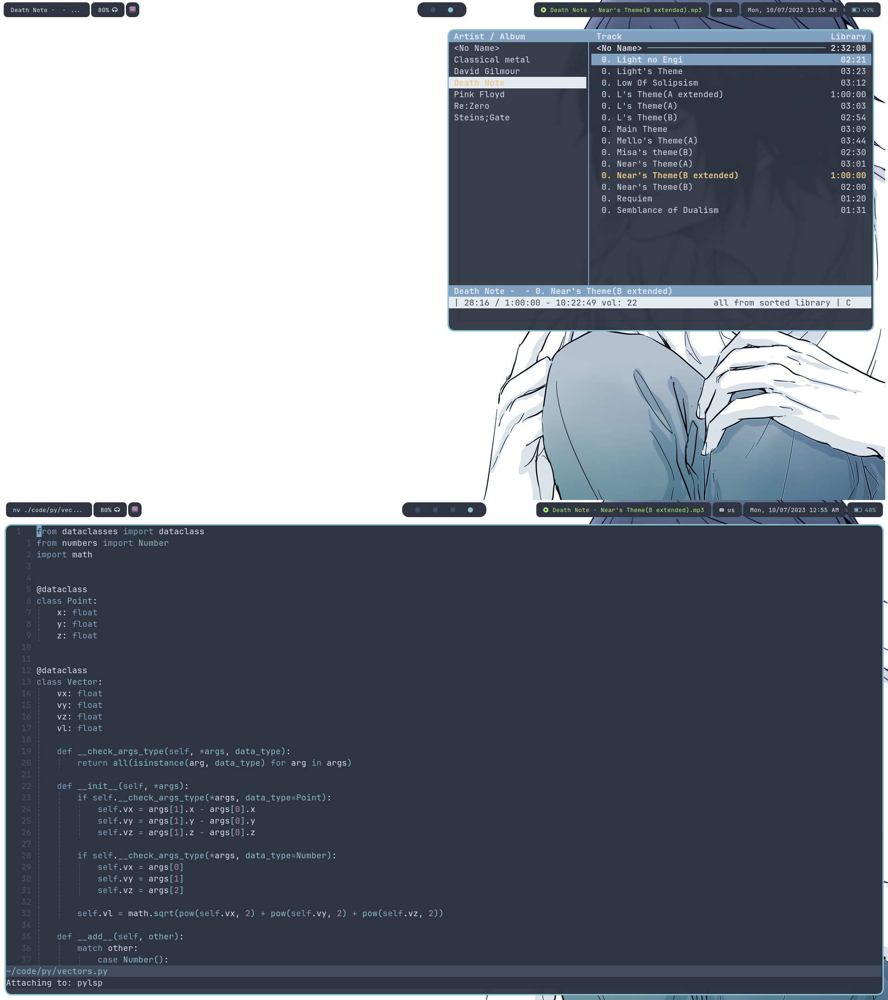

### Rice

# Setup
- **wm** [**`hyprland`**](https://github.com/hok7z/dotfiles/tree/main/.config/hypr)
- **terminal** [**`foot`**](https://github.com/hok7z/dotfiles/tree/main/.config/foot)
- **editor** [**`neovim`**](https://github.com/hok7z/dotfiles/tree/main/.config/nvim)
- **status bar** [**`waybar`**](https://github.com/hok7z/dotfiles/tree/main/.config/waybar)
- **launcher** [**`wofi`**](https://github.com/hok7z/dotfiles/tree/main/.config/wofi)
- **shell** [**`fish`**](https://github.com/hok7z/dotfiles/tree/main/.config/fish)
- **notifications** [**`dunst`**](https://github.com/hok7z/dotfiles/tree/main/.config/dunst)
- [**`shell scripts`**](https://github.com/hok7z/dotfiles/tree/main/.config/scripts)
- [**`user systemd units`**](https://github.com/hok7z/dotfiles/tree/main/.config/systemd/user)

# TODO
- [x] Neovim
  - [x] Migrate from packer to lazy
  - [ ] Debugger Protocol
  - [ ] Quickfix
